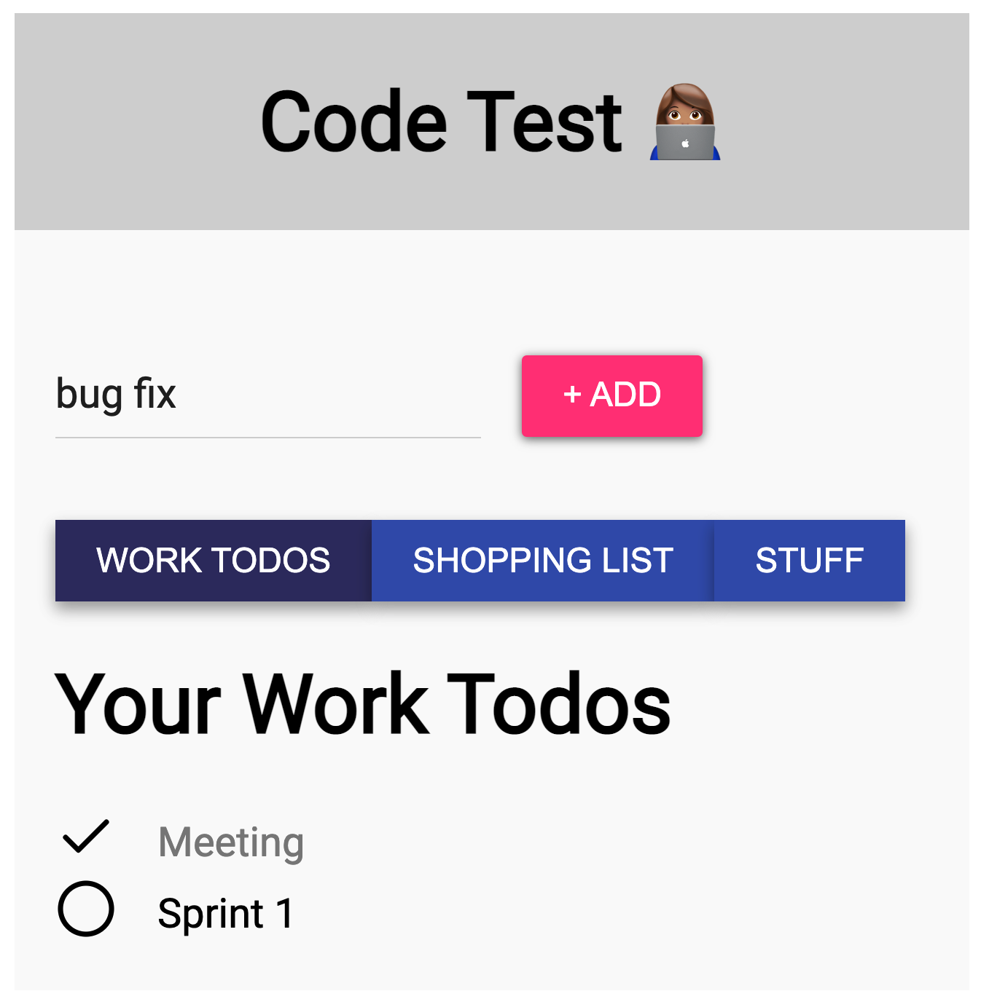

### Added NPM Libraries
- history npm package for the beta React Router 6's peer dependencies
- uuid npm package for GUID (globally unique id) generation
- react-feather npm package for icons

### React Router Extra Info
- Stable version will be released soon

#### Using React Router 6 (Beta 1)
- https://www.npmjs.com/package/react-router/v/6.0.0-beta.1
- Released August 14, 2021

#### React Router 6 Beta 1 Release Notes
- https://github.com/remix-run/react-router/releases
- The long awaited Beta 1, a year after the released of Beta 0
- Delayed because React Router's authors were too busy developing the Remix framework
- https://remix.run/ a React framework

### Tips
- a state management library is a better choice for an app that has multiple contexts

### Info
- you will notice a flicker if you visit a page for 1st time because of lazy loading or code splitting
- the flicker shows the on-demand browser's download as you visit every page

## Development Flow
- Create the 3 pages first
- Create a router with lazy loading
- Create the MainLayout template that will serve as the template of the pages
- Create a navigation bar
- Make sure you can navigate to all the pages
- Create a styled component file for the MainLayout
- Create a global style
- Create a model for the Todo object
- Create a DELETE functionality for the Work Todo
- NOTE: DELETE is the easiest to do because it does not require an input field
- Data will be in-memory in the beginning using the default values
- Create a context for Work Todo
- NOTE: Finishing this context will make the creation of the other 2 contexts easier
- Create an action type for the Work Todo
- Create an action function for the Work Todo
- Set up the reducer for the Work Todo
- Create a global context
- Use the useReducer
- Create an initial value of an array with 2 objects of todos to be tested later on the page
- Use the provider of the Work Todo
- Fill the value prop; TypeScript will help you here; just press ctrl space
- Pass the dispatchers with action arguments
- Use the right function that matches the right dispatcher
- Use the global context in the App.tsx. Wrap the content of the app
- Use the useContext in the WorkTodosPage
- See a list of todos made by the default values from the reducer
- Use an onClick event to delete a todo item
- Do the update functionality for toggling the property done
- NOTE: Update is the 2nd easiest because it does not require a work, it just needs to update the property done
- Do the add functionality
- Create a form with a one input field and submit button
- After seeing the whole functionalities of Work Todo context, do the other contexts
